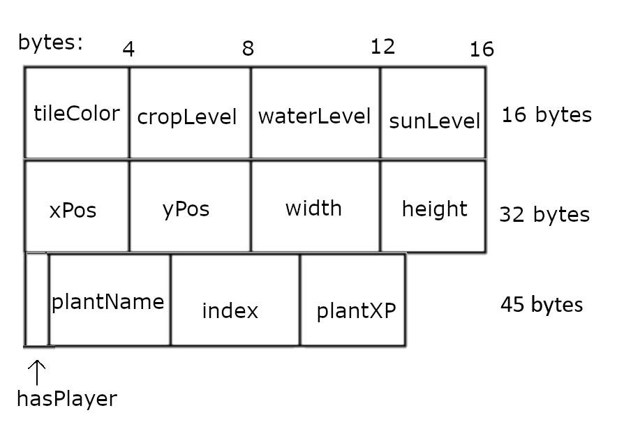

# cmpm-121-final devlogs

##Devlog Entry - 12/5/24
### How we satisfied the software requirements.
 - F0.a - same as last week
 - F0.b - same as last week
 - F0.c - same as last week
 - F0.d - same as last week
 - F0.e - same as last week
 - F0.f - same as last week
 - F0.g - same as last week
 - F1.a - Our game’s grid is saved in an AoS format. Each tile of our game contains data from a structure, which contains a lot of data the tile needs such as position, water and sun levels, plant information, tile color, the plant data, and if the tile has the player. All of those previous values are numbers, and the player being on the tile is a boolean. This means that each structure uses 45 bytes of data, since we have 11 numbers (4 bytes each) and 1 boolean value (1 byte). Since our grid is a 25 wide and 14 tall board of tiles, this means we have 350 structures in our array, for a total size of 15750 bytes in the save file. Below is a visual representation of our breakdown for a single index of our array.

 - F1.b - We introduced a button into our game labeled as “Save game” which prompts the player to choose a save slot, allowing them to choose between save slots 1, 2, and 3. This works by saving our data to local storage using a key in the format of “saveData[fileNumber].[saveNumber]” where file number is the entered save slot. 
 - F1.c - The autosave system is tied with the undo and redo system as well as the advanceTime button. By default, the game creates autosaves in the format “saveData[fileNumber].[saveNumber]” using localStorage. The currently active saveNumber is saved in localStorage for each fileNumber as well and is used to load the state of the previous session while allowing the previous undo and redo stack to still be functional. A boardTile array is encoded into base64 to save space in saves, and decoded when loading. An autosave is generated every time the advanceTime button is pressed.
 - F1.d - Undo simply increments the undo stack pointer, which is saved to the variable index, which is loaded from local storage when refreshing the game, then loads the save that the stack pointer points to. As a consequence, saving a game results in all saveData entities with a saveNumber higher than index being flushed. Redo is also simple, decrementing index to load the previous autosave. 

### Reflection
We retroactively redefined the properties of a boardTile to accommodate for the AoS format. For example, we had to remove plantColor and calculate its color upon creation using plantName to make space for other information. This was key to saving data because when serialized, strings take up a lot more space than numbers. While it took a lot of work going through all of our different files in order to accomodate this change, we are glad that we made this change. The biggest takeaway from this is that we had many variables that we didn't actually *need* when we could repurpose the variables we already had to have multiple different uses.

## Devlog Entry - 12/2/24
### How we satisfied the software requirements.
Our character (the black square) can move over a 2D grid by using either WASD or the arrow keys. Time gets advanced by the user pressing a button marked as "advance time" below the grid. When the character is standing on a tile, the space bar will allow a plant to be planted. If a plant is already on that square, then the plant gets harvested. Sun is randomly generated each turn on a tile, but water gets randomly assigned in the beginning of the game before being updated based on the water of adjacent tiles each turn. There are 3 plants which can be selected by pressing a button for each plant, and the sizes of the plants change based on their growth levels. In order to grow, plants are assigned XP points each turn based on their incoming sunlight and water levels, with the water level being determined by spatial rules. The game is decided to be won when the player has 10 or more plants at level 3.

### Reflection
We at first wanted to make our game based around the idea of having a hand of cards representing plants, water, sun, etc. but were quickly dissuaded from that idea. We also were told that trying to implement the game in Unity would make some of the later steps of the project much harder to implement. In order to accommodate both of these changes, we swapped our project to typescript and tried to stick to completing the requirements without increasing the scope of the project.

## Devlog Entry - 11/15/24

### The Team:
 - Tools Lead: Brian Feng
 - Engine Co-Lead: Eion Ling
 - Engine Co-Lead: Connor Lowe
 - Design Co-Lead: Charlize Serrano
 - Design Co-Lead: Annie McKay 

### Tools & Materials:
  Our main engine/framework that we plan to use is TypeScript + HTML5. We chose to use this since we’re familiar with working with it from this CMPM 121 class. 
  We’ll be scripting in TypeScript + HTML5. We've coded in Typescript for this entire class, so we will be able to fulfill our requirements. 
  We chose to use VSCode for our IDE because we are all familiar with it from using it in this class, and the plugins will be useful for keeping a consistent coding style. For art we will use aseprite. We chose to make our game with pixel art because it’s easy to have a consistent style across artists, and we believe that it is easier to animate pixel art sprites than 3D or hand drawn sprites.
  For our alternate platform of choice we will be using TypeScript + ThreeJS to Adam's recommendation! Our goal is to create a reasonably scoped browser game within these next couple of weeks.

### Outlook:
  We’re hoping to learn more about creating games in a group setting and becoming familiar with using these tools with multiple people. I think the hardest and riskiest part of the project is coordinating our coding. Some of our parts of the project relies on a teammate’s code. We also cannot have 2 people working on the same part of the project otherwise conflicts may occur.
  For a spin on our game, we were thinking we would take the general game loop and turn it into a deck builder. We would start out with a base pack of cards and a small grid and as the player progresses they unlock new seeds to obtain. While we would maintain the general game loop of a person going over tile-grids and planting, the player-view would be top down with a hand of cards at the bottom of the screen. To play a hand the player will move around and place a selected card on the open grid, which would apply to the ground in front of them.

